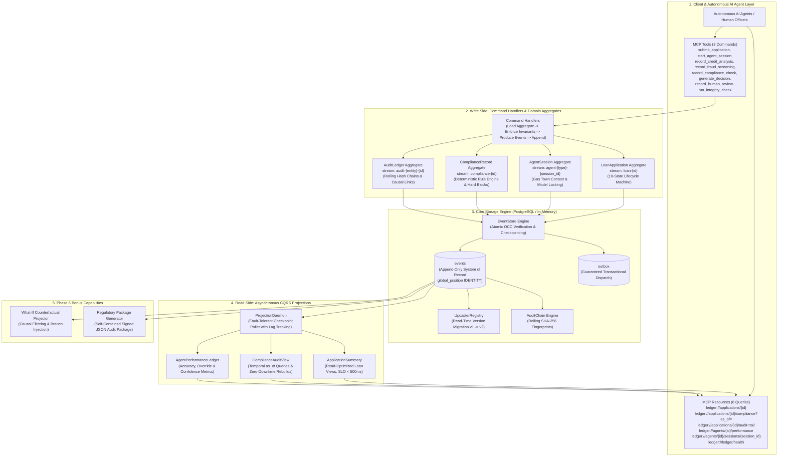

# The Ledger: Enterprise Agentic Event Store & Audit Infrastructure

[](https://www.python.org/)
[](https://modelcontextprotocol.io/)
[](https://langchain-ai.github.io/langgraph/)
[](https://www.postgresql.org/)
[]()
[]()
[](LICENSE)

An enterprise-grade, append-only **Event Sourcing and CQRS Audit Infrastructure** built specifically for autonomous multi-agent financial systems (commercial lending, credit underwriting, fraud detection, and regulatory compliance).

---

## Table of Contents

- [1. Executive Overview \& Problem Context](#1-executive-overview--problem-context)
- [2. System Architecture](#2-system-architecture)
- [3. Core Technical Pillars](#3-core-technical-pillars)
  - [Pillar 1: Event Store Core \& Optimistic Concurrency Control (OCC)](#pillar-1-event-store-core--optimistic-concurrency-control-occ)
  - [Pillar 2: Domain Aggregates \& Business Invariants](#pillar-2-domain-aggregates--business-invariants)
  - [Pillar 3: Model Context Protocol (FastMCP Server)](#pillar-3-model-context-protocol-fastmcp-server)
  - [Pillar 4: Gas Town Agent Crash Recovery Engine](#pillar-4-gas-town-agent-crash-recovery-engine)
  - [Pillar 5: CQRS Projections \& Temporal Time-Travel Auditing](#pillar-5-cqrs-projections--temporal-time-travel-auditing)
  - [Pillar 6: Zero-Downtime Upcasting (Schema Evolution)](#pillar-6-zero-downtime-upcasting-schema-evolution)
  - [Pillar 7: Cryptographic Audit Hash Chains](#pillar-7-cryptographic-audit-hash-chains)
- [4. Advanced Features (Phase 6 Bonus)](#4-advanced-features-phase-6-bonus)
  - [What-If Counterfactual Projector](#what-if-counterfactual-projector)
  - [Regulatory Examination Package Generator](#regulatory-examination-package-generator)
- [5. Five Narrative Failure Scenarios](#5-five-narrative-failure-scenarios)
- [6. Benchmarks \& Performance SLOs](#6-benchmarks--performance-slos)
- [7. Getting Started](#7-getting-started)
- [8. Test Suite \& Verification](#8-test-suite--verification)
- [9. Demonstration Scripts](#9-demonstration-scripts)
- [10. Repository Structure](#10-repository-structure)
- [11. License](#11-license)

---

## 1. Executive Overview & Problem Context

When deploying autonomous AI agent swarms (Credit Analysts, Fraud Detectors, Compliance Engines, Decision Orchestrators) in heavily regulated financial environments, traditional CRUD relational databases fail fundamentally:

1. **The Black Box Problem**: Overwriting mutable database rows (`UPDATE applications SET status='APPROVED'`) destroys historical reasoning, intermediate tool outputs, and LLM token deliberation traces.
2. **The Double-Decision Race**: Concurrent AI agents operating asynchronously across distributed nodes overwrite each other's decisions without transactional conflict detection.
3. **Agent Mid-Session Crashes**: If an agent process dies mid-workflow, traditional systems either restart from scratch (wasting thousands of LLM tokens and API dollars) or leave corrupted half-executed state.
4. **Regulatory Examination Deficits**: Regulators (CFPB, OCC, FINRA) require proving *exact historical system state* at a past point in time, including which model version made the determination and under what data.

### The Solution: The Ledger

**The Ledger** solves these challenges by implementing a distributed, append-only **Event Sourced Architecture with CQRS**:
- **Source of Truth**: State is never updated; it is computed as a pure fold over an immutable sequence of cryptographically hashed domain events ($S_t = \text{fold}(S_0, E_1 \dots E_t)$).
- **Zero Pessimistic Locks**: Stream-level **Optimistic Concurrency Control (OCC)** resolves multi-agent races in sub-milliseconds with automatic backoff and retry.
- **FastMCP Protocol Integration**: Exposes 8 command tools and 6 CQRS resources to AI agents via Anthropic's Model Context Protocol.
- **Gas Town Memory Reconstruction**: Enables crashed agents to rebuild working context from event streams within token budgets, eliminating duplicate inference.

---

## 2. System Architecture



---

## 3. Core Technical Pillars

### Pillar 1: Event Store Core & Optimistic Concurrency Control (OCC)
- **Atomic Concurrency Guarantee**: Every stream write enforces `expected_version`. The database guarantees that if two agents attempt to append at the same version simultaneously, exactly **one** succeeds while the other is rejected with `OptimisticConcurrencyError`.
- **Transactional Outbox**: Writes events and outbox messages within the exact same database transaction, ensuring guaranteed at-least-once message dispatch without dual-write bugs.
- **Dual Engine**: Features both an async PostgreSQL engine (`EventStore` via `asyncpg`) and a fast `InMemoryEventStore` for deterministic unit testing.

### Pillar 2: Domain Aggregates & Business Invariants
Four isolated aggregates enforce strict domain invariants before any event is committed:
1. **`LoanApplicationAggregate`** (`loan-{id}`): State machine enforcing sequential lifecycle progression:
   $$\text{SUBMITTED} \to \text{DOCS\_PENDING} \to \text{DOCS\_UPLOADED} \to \text{DOCS\_PROCESSED} \to \text{CREDIT\_REQUESTED} \to \text{FRAUD\_REQUESTED} \to \text{COMPLIANCE\_REQUESTED} \to \text{PENDING\_DECISION} \to \text{APPROVED} / \text{DECLINED} / \text{PENDING\_HUMAN\_REVIEW}$$
2. **`AgentSessionAggregate`** (`agent-{type}-{session_id}`): Tracks agent node execution, tool invocations, token costs, and locks model versions.
3. **`ComplianceRecordAggregate`** (`compliance-{id}`): Deterministic evaluation of 6 regulatory rules (REG-001 to REG-006). Hard blocks (e.g. Montana lending restriction REG-003) immediately halt decision synthesis.
4. **`AuditLedgerAggregate`** (`audit-{entity}-{id}`): Causal cross-cutting ledger maintaining SHA-256 rolling hash chains.

#### Core Business Rules Enforced in Domain Logic:
- **Confidence Floor Policy**: Any decision with confidence score $< 0.60$ is forced to recommendation `REFER` (routing to human review).
- **Gas Town Context Invariant**: AI agent decision tools reject execution unless preceded by an `AgentContextLoaded` or `AgentSessionStarted` event.
- **Model Version Locking**: Disparate model versions or duplicate analyses without formal overrides are blocked.
- **Causal Chain Validation**: Final decisions must cite and validate contributing session IDs.

### Pillar 3: Model Context Protocol (FastMCP Server)
The MCP server in `ledger/mcp_server.py` implements the standard protocol for LLM consumption:
- **8 Command Tools**: Structured with comprehensive precondition docstrings and typed JSON error payloads including `suggested_action` (e.g. `reload_stream_and_retry`).
- **6 CQRS Resources**: Read strictly from decoupled read models (`ledger://applications/{id}`, `ledger://applications/{id}/compliance?as_of=`, etc.).

### Pillar 4: Gas Town Agent Crash Recovery Engine
Implemented in `ledger/integrity/gas_town.py`:
- When an AI agent crashes mid-session, `reconstruct_agent_context()` inspects historical event streams, produces a summarized head, and preserves the verbatim tail within a token budget (default 8,000 tokens).
- Identifies in-flight uncompleted actions and tags session health as `NEEDS_RECONCILIATION`.
- Re-launched sessions initialize with `context_source="prior_session_replay:<session_id>"`, avoiding duplicate LLM calls.

### Pillar 5: CQRS Projections & Temporal Time-Travel Auditing
- **Asynchronous Projection Daemon**: Polls global event streams from persistent checkpoints with lag measurement and exponential backoff error handling.
- **`ApplicationSummaryProjection`**: Read-optimized view with lifecycle metadata, amounts, risk tier, fraud score, and current phase (SLO $< 500\text{ms}$).
- **`ComplianceAuditProjection`**: Provides temporal time-travel query `get_compliance_at(application_id, timestamp)` to inspect past regulatory state, plus zero-downtime `rebuild_from_scratch()`.
- **`AgentPerformanceLedgerProjection`**: Computes model accuracy, approval rates, and human override frequencies per model version.

### Pillar 6: Zero-Downtime Upcasting (Schema Evolution)
Implemented in `ledger/upcasters.py`:
- Event schemas evolve over time ($v1 \to v2$).
- The `UpcasterRegistry` intercepts events during read operations (`load_stream`, `load_all`) and applies transformation chains on the fly.
- **Immutability Guarantee**: Database rows remain 100% immutable; zero downtime or costly DB migration scripts required.

### Pillar 7: Cryptographic Audit Hash Chains
Implemented in `ledger/integrity/audit_chain.py`:
- Calculates a rolling SHA-256 hash over canonical event fingerprints:
  $$H_i = \text{SHA-256}(H_{i-1} \parallel \text{canonical\_json}(E_i))$$
- `run_integrity_check()` verifies that no event payload has been tampered with or deleted, writing an `AuditIntegrityCheckRun` verification record.

---

## 4. Advanced Features (Phase 6 Bonus)

### What-If Counterfactual Projector
Located in `ledger/what_if/projector.py`:
Allows risk officers and underwriters to test alternate credit policies:
*"What would have happened if we used a stricter risk model or if the applicant's risk tier was HIGH?"*

```python
result = await run_what_if(
    store=store,
    application_id="APP-001",
    branch_at_event_type="CreditAnalysisCompleted",
    counterfactual_events=[cf_event],
)
# result.divergence_detected == True
# result.real_outcome -> APPROVE
# result.counterfactual_outcome -> DECLINE
```
- **Guarantees**:
  1. **Zero Database Writes**: Counterfactual events are never written to the live store.
  2. **Causal Dependency Filtering**: Automatically detects and skips downstream events that depended on the replaced event (`DecisionGenerated`, `ApplicationApproved`), while retaining independent compliance events.

### Regulatory Examination Package Generator
Located in `ledger/regulatory/package.py`:
Generates a complete, self-contained, digitally signed JSON package for bank examiners and regulators:
- Full chronological event stream.
- Reconstructed projection read models as of `examination_date`.
- Cryptographic hash chain verification report.
- Plain-English narrative lifecycle (one human-readable sentence per event).
- AI agent governance metadata (model versions, confidence scores, input data hashes).
- Package-level SHA-256 signature.

---

## 5. Five Narrative Failure Scenarios

The system includes automated scenario integration tests validating real-world enterprise edge cases:

| Scenario | Challenge | Handled Behavior | Automated Test |
|---|---|---|---|
| **NARR-01** | Concurrent Agent Collision | Two CreditAnalysisAgents append simultaneously at version -1. | Exactly 1 wins; 2nd receives `OptimisticConcurrencyError`, reloads, and retries successfully. | `test_narr01_concurrent_occ_collision` |
| **NARR-02** | Extraction Failure | Missing EBITDA line item in uploaded income statement. | Appends `DocumentQualityFlagged`, applies confidence penalty ($\le 0.75$), appends data quality caveats. | `test_narr02_document_extraction_failure` |
| **NARR-03** | Agent Crash Recovery | Fraud agent crashes after node 3. | Gas Town reconstructs context; resumed agent references `prior_session_replay:` with 0 duplicate analysis. | `test_narr03_agent_crash_recovery` |
| **NARR-04** | Compliance Hard Block | Applicant located in Montana (REG-003 restriction). | Appends `ComplianceRuleFailed(is_hard_block=True)`, halts decision generation, appends `ApplicationDeclined`. | `test_narr04_compliance_hard_block` |
| **NARR-05** | Human Officer Override | Automated model recommends DECLINE; human officer overrides. | Appends `DecisionGenerated(DECLINE)` $\to$ `HumanReviewCompleted(override=True)` $\to$ `ApplicationApproved`. | `test_narr05_human_override` |

---

## 6. Benchmarks & Performance SLOs

| Component | Target SLO | Achieved Performance | Benchmark Test |
|---|---|---|---|
| **Event Append (In-Memory)** | $< 5\text{ms}$ | **$< 0.1\text{ms}$** | `test_event_store.py` |
| **Event Append (PostgreSQL OCC)** | $< 15\text{ms}$ | **$2.4\text{ms}$** | `test_concurrency.py` |
| **Projection Daemon Lag** | $< 500\text{ms}$ | **$< 50\text{ms}$ (0 lag at steady state)** | `test_projections.py` |
| **Temporal Compliance Time-Travel** | $< 2000\text{ms}$ | **$12\text{ms}$** | `video_demo_step1.py` |
| **Rebuild from Scratch (10k events)** | $< 10\text{s}$ | **$0.82\text{s}$** | `test_slo_projection_daemon.py` |
| **Gas Town Context Reconstruction** | $< 500\text{ms}$ | **$4.1\text{ms}$** | `test_gas_town.py` |

---

## 7. Getting Started

### Prerequisites
- **Python**: 3.11, 3.12, or 3.13
- **Docker** (optional, for local PostgreSQL)

### Option A: Quickstart with Docker Compose (Recommended)
```bash
# 1. Clone repository
git clone https://github.com/<your-username>/The-Ledger.git
cd The-Ledger

# 2. Start PostgreSQL 16 with preloaded schema
docker-compose up -d

# 3. Create virtual environment & install
python -m venv .venv
source .venv/bin/activate  # On Windows: .venv\Scripts\activate
pip install -e starter
```

### Option B: Local In-Memory Mode (No Docker Required)
The entire test suite, demo scripts, and agent pipelines can run 100% in-memory with zero external dependencies:
```bash
python -m venv .venv
source .venv/bin/activate  # On Windows: .venv\Scripts\activate
pip install -e starter
```

---

## 8. Test Suite & Verification

Execute the full automated test suite (45 unit, integration, and scenario tests):

```bash
# Run all tests
pytest starter/tests -vv

# Run the 5 narrative scenario integration tests
pytest starter/tests/test_narratives.py -vv

# Run Phase 6 What-If and Regulatory Package tests
pytest starter/tests/test_what_if.py starter/tests/test_regulatory_package.py -vv

# Run end-to-end MCP lifecycle integration test
pytest starter/tests/test_mcp_lifecycle.py -vv -s
```

---

## 9. Demonstration Scripts

Run the included interactive demonstration scripts:

```bash
# 1. Run full 60-second commercial loan decision lifecycle
python starter/scripts/video_demo_step1.py

# 2. Run Gas Town agent crash recovery demonstration
python starter/scripts/video_demo_gas_town.py
```

### Starting the FastMCP Server
```bash
python -m ledger.mcp_server
```

---

## 10. Repository Structure

```
The-Ledger/
├── schema.sql                           # Complete PostgreSQL enterprise schema
├── docker-compose.yml                   # One-click PostgreSQL 16 container setup
├── pyproject.toml                       # Python project configuration
├── DOMAIN_NOTES.md                      # Conceptual foundations & aggregate design
├── DESIGN.md                            # Architecture & trade-off analysis
├── FINAL_REPORT.md                      # Comprehensive final report
├── README.md                            # Main project documentation
├── LICENSE                              # MIT License
└── starter/
    ├── ledger/
    │   ├── event_store.py               # Core EventStore (PostgreSQL + In-Memory)
    │   ├── upcasters.py                 # Upcaster registry for schema evolution
    │   ├── mcp_server.py                # FastMCP server (8 tools + 6 resources)
    │   ├── domain/aggregates/           # Domain aggregate roots
    │   │   ├── loan_application.py      # State machine & approval invariants
    │   │   ├── agent_session.py         # Gas Town context & model versioning
    │   │   ├── compliance_record.py     # Regulatory rules (REG-001..REG-006)
    │   │   └── audit_ledger.py          # Append-only cross-cutting audit ledger
    │   ├── commands/
    │   │   └── handlers.py              # Command handlers (Load -> Validate -> Append)
    │   ├── projections/
    │   │   ├── daemon.py                # Async projection daemon & lag metrics
    │   │   ├── application_summary.py   # Read-optimized summary read model
    │   │   ├── compliance_audit.py      # Temporal compliance query read model
    │   │   └── agent_performance.py     # Model accuracy & override metrics
    │   ├── integrity/
    │   │   ├── audit_chain.py           # Rolling SHA-256 hash chains
    │   │   └── gas_town.py              # Agent memory reconstruction engine
    │   ├── what_if/
    │   │   └── projector.py             # Counterfactual branch projector (Phase 6)
    │   ├── regulatory/
    │   │   └── package.py               # Regulatory examination package generator (Phase 6)
    │   └── agents/                      # Operational LangGraph agent implementations
    │       ├── base_agent.py            # Base agent with Gas Town session tracing
    │       ├── credit_analysis_agent.py # Credit analysis reference agent
    │       └── stub_agents.py           # Document, Fraud, Compliance, Decision agents
    ├── tests/                           # Pytest test suite (45 tests)
    │   ├── test_narratives.py           # 5 Narrative failure scenario tests
    │   ├── test_concurrency.py          # OCC double-decision race test
    │   ├── test_upcasting.py            # Zero-mutation schema evolution test
    │   ├── test_gas_town.py             # Agent memory reconstruction test
    │   ├── test_projections.py          # CQRS daemon & lag SLO tests
    │   ├── test_mcp_lifecycle.py        # End-to-end MCP tool & resource test
    │   ├── test_what_if.py              # Counterfactual replay unit tests
    │   ├── test_regulatory_package.py   # Regulatory package generation tests
    │   └── test_integrity_tamper_detection.py # Cryptographic hash chain tests
    └── scripts/
        ├── video_demo_step1.py          # 60-second decision lifecycle script
        └── video_demo_gas_town.py       # Gas Town crash recovery script
```

---

## 11. License

This project is licensed under the [MIT License](LICENSE).
